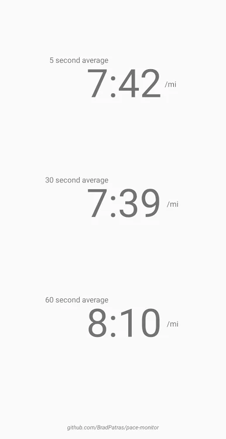

### Pace Monitor
Live monitoring of running pace (minutes per mile) calculated in three ways using the previous 5, 30 and 60 seconds of speed data from device GPS

### Libraries Used
- **Karumi:** for permission requests
- **FusedLocationProvider:** for speed monitoring
- **EventBus:** used by service to post speed reports
- **LiveData:** Handling the stream of speed data from the service to the ui (initially implemented with rxjava)
- ~~**RxJava:** mostly just PublishSubjects and Consumers for handling the stream of speed reports from the service and updating the UI~~

&nbsp;

